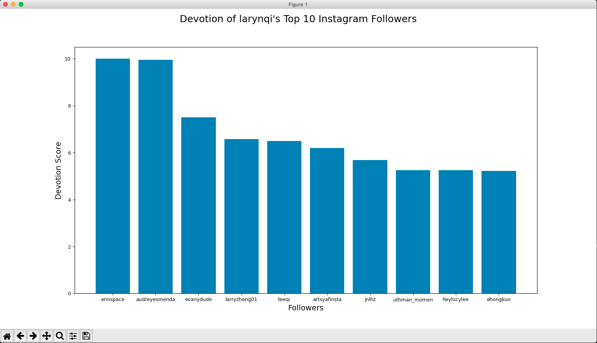
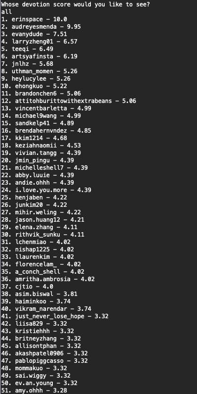

# instaBot 
**An Instagram bot for gauging follower interaction on your posts. It can also find users who are not following back.**

## Demo

  
<i>Plot of top 10 followers</i>
 

  
<i>Once the bot finishes running, you can query for the complete list of scores (depicted above) as well as the individual score of a specific follower</i>
 

## Running the bot
- If you don't have Python download it [here](https://www.python.org/downloads/)
- If you don't have pip, run `sudo easy_install pip`
- Check if you have virtualenv by running `pip list`
  - If you don't have it, install it by running `sudo pip install virtualenv`
- cd into the repo then run the following commands:  
`virtualenv -p python3 venv`  
`source venv/bin/activate`  
`pip3 install selenium` (in your venv)  
`pip3 install webdriver-manager` (in your venv)  
`pip3 install matplotlib` (in your venv)  
  - Sanity check: Your terminal ps1/prompt should now start with `(venv)`
- Download the [ChromeDriver](https://chromedriver.chromium.org/downloads)
  - Check your Chrome version by clicking the 3 dots in the top right of your browser 
  - Click "Help"
  - Click "About Google Chrome"
  - Download the corresponding driver for your OS and unzip the file in your downloads
  - Move the ChromeDriver to /usr/local/bin by typing `mv ~/Downloads/chromedriver /usr/local/bin`
    - If you're getting a permission denied error run `sudo mv ~/Downloads/chromedriver /usr/local/bin`
- Enter in your Instagram username and password as strings in resources.py with the text editor of your choice
- Run main.py via command line with your Python version
  - ex: `python3 main.py`  
   
You're all set! Watch the bot work its magic :)

### Resources
  - Credits go to [@Code Drip](https://www.youtube.com/watch?v=d2GBO_QjRlo&) for the Selenium tutorial.
